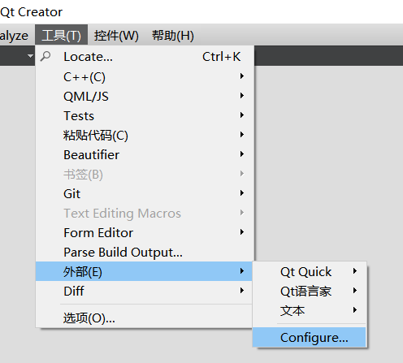
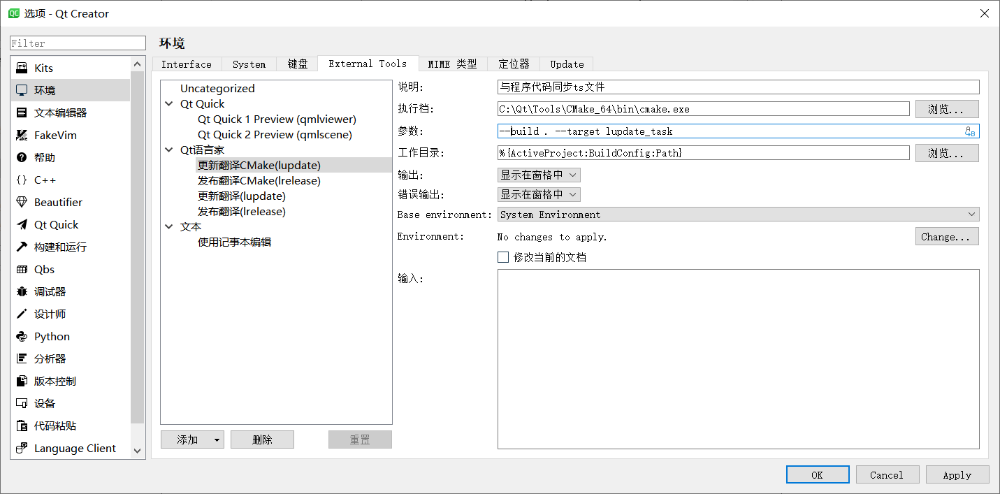
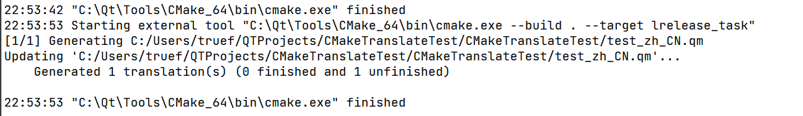
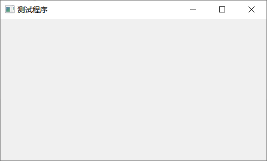

# Qt Creator + CMake 管理工程翻译文件

---

Qt Creator对QMake的支持是非常完善的，对项目构建、翻译文件的创建与更新、Qt元数据系统都做到了系统的支持。

虽然Qt Creator也支持CMake，但是完全谈不上友好。考虑到官方在Qt6以后将全面转向CMake，那么使用CMake管理Qt的工具也应该是一个熟练使用Qt的开发者的必备技能了。

本文谈一谈如何设置Qt Creator，使其能自动更新、发布翻译文件。

> 观前提醒：需要对CMake的基本语法有一定的了解，至少要知道CMake环境变量。

## 创建项目

直接使用默认配置创建项目即可，为了方便讲解，我将自动生成的`CMakeLists.txt`中不必要的代码都删除了。

+ 目录结构


+ CMakeLists.txt

````
# 指定CMake的最低版本
cmake_minimum_required(VERSION 3.5)

# 指定工程名
project(CMakeTranslateTest LANGUAGES CXX)

# 指定包含当前路径
set(CMAKE_INCLUDE_CURRENT_DIR ON)

# 设置Qt工具链的环境变量
set(CMAKE_AUTOUIC ON)
set(CMAKE_AUTOMOC ON)
set(CMAKE_AUTORCC ON)

# 设置C++版本
set(CMAKE_CXX_STANDARD 11)
set(CMAKE_CXX_STANDARD_REQUIRED ON)

# 查找Qt库
find_package(QT NAMES Qt6 Qt5 COMPONENTS Widgets REQUIRED)
find_package(Qt${QT_VERSION_MAJOR} COMPONENTS Widgets REQUIRED)

# 将项目中的源文件添加到列表中
set(PROJECT_SOURCES
        main.cpp
        MainWindow.cpp
        MainWindow.h
)

# 将源文件和资源文件添加到目标可执行文件中
add_executable(${PROJECT_NAME} ${PROJECT_SOURCES} res.qrc)

# 将Qt库链接到目标中
target_link_libraries(${PROJECT_NAME} PRIVATE Qt${QT_VERSION_MAJOR}::Widgets)
````

## 添加翻译需求

````
#include "MainWindow.h"

MainWindow::MainWindow(QWidget *parent) : QMainWindow(parent) {
    setWindowTitle(tr("Test Application"));
}

MainWindow::~MainWindow() {
}

````

在`MainWindow.cpp`中使用一次`QObject::tr`，之后使用这个来测试。

## 添加翻译模块

首先需要查找Qt Linguist工具，在`CMakeLists.txt`中添加

````
find_package(QT NAMES Qt6 Qt5 COMPONENTS LinguistTools REQUIRED)
find_package(Qt${QT_VERSION_MAJOR} COMPONENTS LinguistTools REQUIRED)
````

这里CMake会将Qt Linguist工具中定义的方法加载进来，之后我们直接使用官方定义的函数或宏即可。

## 设置要生成的翻译文件

继续向`CMakeLists.txt`中添加内容

````
# 初始化要使用的列表
set(TS_FILES)
set(QM_FILES)

# 将要生成的翻译文件添加到列表中
list(APPEND TS_FILES ${CMAKE_CURRENT_SOURCE_DIR}/test_zh_CN.ts)

# 设置翻译文件的生成路径，如果不指定就会生成在CMakeFiles的目录里
set_source_files_properties(${TS_FILES}
    PROPERTIES OUTPUT_LOCATION ${CMAKE_CURRENT_SOURCE_DIR}
)
````

此时`TS_FILES`列表中就是我们需要生成的翻译文件的路径，它现在还不存在，`QM_FILES`现在还是一个空的列表

## 调用创建翻译的方法

继续向`CMakeLists.txt`中添加内容

````
qt5_create_translation(QM_FILES ${TS_FILES} ${PROJECT_SOURCES})
````

### 工具介绍

Qt Linguist工具中有两个可执行文件，分别是`lupdate`与`lrelease`，前者用来生成`ts`文件，后者用来生成`qm`文件。

要生成`ts`文件，`lupdate`需要知道项目中有哪些源文件。

+ 在QMake项目中，项目文件是`pro`文件，`lupdate`是可以直接通过`pro`文件获取到项目中所有的源文件的。

+ `lupdate`接受一个`pro`文件的路径作为参数，然后接受`-ts`标记指定的输出文件。

#### QMake

````
lupdate test.pro -ts test_zh_CN.ts
````

运行这行命令后，`lupdate`就会从`pro`文件中获取QMake项目的所有源文件并分析所有需要翻译的字符串然后生成`ts`文件。

#### CMake

但是我们现在是CMake项目，你不能把`CMakeLists.txt`当作工程文件传给它。

````
lupdate CMakeLists.txt -ts test_zh_CN.ts
````

+ 这样做是错误的，因为`lupdate`看不懂`CMakeLists.txt`。

此时，我们需要手动把项目中所有含有源文件的路径传给`lupdate`。

````
lupdate main.cpp MainWindow.cpp MainWindow.h -ts test_zh_CN.ts
````

这样`lupdate`也能输出正确的`ts`文件。

当然，如果真的手动调用`lupdate`的话，其实只需要把包含待翻译字符串的源文件传给它就行了。

那么我们当然要寻求自动化的方式，`qt5_create_translation`这个宏就帮我们自动化地调用了`lupdate`工具。

### 命令解读

`qt5_create_translation`定义在在`Qt5LinguistToolsMacros.cmake`中，你可以在Qt安装路径中的`lib/cmake/Qt5LinguistTools`中找到它。

+ 调用
````
qt5_create_translation(QM_FILES ${TS_FILES} ${PROJECT_SOURCES})
````

+ 我们调用的时候，第一个参数设为`QM_FILES`，后面的就是`ts`文件的路径和所有源文件的路径了。

````
function(QT5_CREATE_TRANSLATION _qm_files)
    set(options)
    set(oneValueArgs)
    set(multiValueArgs OPTIONS)

    # 此处解析了options与lupdate_files，具体过程可以查询cmake_parse_arguments的文档
    cmake_parse_arguments(_LUPDATE "${options}" "${oneValueArgs}" "${multiValueArgs}" ${ARGN})
    set(_lupdate_files ${_LUPDATE_UNPARSED_ARGUMENTS})
    set(_lupdate_options ${_LUPDATE_OPTIONS})

    # 到这一步，_lupdate_files中包含的就是ts文件与项目的源文件
    set(_my_sources)
    set(_my_tsfiles)

    # 这里通过扩展名将ts文件与源文件分开存到了两个列表中
    foreach(_file ${_lupdate_files})
        get_filename_component(_ext ${_file} EXT)
        get_filename_component(_abs_FILE ${_file} ABSOLUTE)
        if(_ext MATCHES "ts")
            list(APPEND _my_tsfiles ${_abs_FILE})
        else()
            list(APPEND _my_sources ${_abs_FILE})
        endif()
    endforeach()

    # 这里遍历了所有ts文件
    foreach(_ts_file ${_my_tsfiles})
        if(_my_sources)
          # make a list file to call lupdate on, so we don't make our commands too
          # long for some systems
          get_filename_component(_ts_name ${_ts_file} NAME)
          set(_ts_lst_file "${CMAKE_CURRENT_BINARY_DIR}${CMAKE_FILES_DIRECTORY}/${_ts_name}_lst_file")
          set(_lst_file_srcs)
          foreach(_lst_file_src ${_my_sources})
              set(_lst_file_srcs "${_lst_file_src}\n${_lst_file_srcs}")
          endforeach()

          # Qt官方的做法是，为了避免调用lupdate时有太多的参数（尤其是源文件比较多时）
          # 先将源文件的路径列表写入一个临时文件中（生成在CMake缓存目录）
          # 然后再让lupdate读取这个文件

          get_directory_property(_inc_DIRS INCLUDE_DIRECTORIES)
          foreach(_pro_include ${_inc_DIRS})
              get_filename_component(_abs_include "${_pro_include}" ABSOLUTE)
              set(_lst_file_srcs "-I${_pro_include}\n${_lst_file_srcs}")
          endforeach()

          file(WRITE ${_ts_lst_file} "${_lst_file_srcs}")
        endif()

        # 这里就是关键步骤了，添加了自定义命令，设置OUTPUT为ts文件

        add_custom_command(OUTPUT ${_ts_file}
            COMMAND ${Qt5_LUPDATE_EXECUTABLE}
            ARGS ${_lupdate_options} "@${_ts_lst_file}" -ts ${_ts_file}
            DEPENDS ${_my_sources}
            BYPRODUCTS ${_ts_lst_file} VERBATIM)
    endforeach()

    # 在这里更新了传入的_qm_files
    qt5_add_translation(${_qm_files} ${_my_tsfiles})
    set(${_qm_files} ${${_qm_files}} PARENT_SCOPE)
endfunction()
````

+ 如果你不了解`add_custom_command`这个关键字，可以自行查阅资料。我这里也简单介绍一下。
    + 假如说你用`add_custom_command`定义了一个自定义命令`A`，并设置它的`OUTPUT`参数为一个或一组文件（意思是说这个自定义命令会输出这些文件），设这组文件为`B`；
    + 在后面用`add_library`、`add_executable`或者`add_custom_target`命令定义了一些目标，这些目标中的某些会依赖文件`B`，设对文件`B`有依赖的目标为`C`；
    + 在CMake Build过程中，当Build到了`C`的时候，`A`这个自定义命令就会被执行；
    + 有多少个这样的`C`在，`A`就会被执行多少次；如果Build的目标中，没有一个目标依赖`B`，那么`A`就不会被执行。

+ 我们看到这个宏的定义中为每个`ts`文件做了一次`add_custom_command`操作，并把`ts`文件作为它的`OUTPUT`参数；

+ 那么如果我们后面定义一个依赖这组`ts`文件的目标，当执行这个目标的时候，`lupdate`就会被执行。

+ 同理，`qt5_add_translation`这个宏就会根据`ts`文件的文件名生成一组`qm`文件，并且为这组`qm`文件中的每个也做了一次`add_custom_command`操作，这里不展开讲了。

为了讲解方便，这里调用该方法的时候并没有设置`OPTIONS`，如果你想为`lupdate`配置一些选项也可以加，比如下面这条命令。

````
qt5_create_translation(QM_FILES ${TS_FILES} ${PROJECT_SOURCES} OPTIONS -source-language zh_CN -noobsolete)
````

+ `qt5_create_translation`执行之后，自定义命令已经声明完毕，同时`QM_FILES`也根据`TS_FILES`被更新了。


### 添加翻译目标

继续向`CMakeLists.txt`中添加内容

````
# 添加更新翻译的目标
add_custom_target(lupdate_task DEPENDS ${TS_FILES})

# 添加发布翻译的目标
add_custom_target(lrelease_task DEPENDS ${QM_FILES})
````

+ 需要注意的是，`add_custom_target`定义的目标默认是不在总目标`all`里面的，Qt Creator执行Build的时候，默认目标是`all`目标，也就是`add_library`和`add_executable`的那些目标，如果你想在每次Build的时候把更新翻译也执行了，那么可以修改为下面这样。

````
add_custom_target(lupdate_task ALL DEPENDS ${TS_FILES})
add_custom_target(lrelease_task ALL DEPENDS ${QM_FILES})
````

+ 我是不建议把翻译目标也加到`ALL`中去的，因为翻译文件一般不可能导致BUG，程序开发与翻译也是两个完全不同的环节，而且`lupdate`与`lrelease`是不可能一起执行的，你肯定得先执行`lupdate`更新`ts`文件，然后用Qt Linguist手动把翻译工作做完，再执行`lrelease`把`ts`文件转为`qm`文件。

## 修改 Qt Creator 配置

### QMake

+ 我们在使用QMake的时候，一般都是这么改`pro`文件的
````
# test.pro

TRANSLATIONS += \
    test_zh_CN.ts
````

+ 然后会去菜单里运行`更新翻译`与`发布翻译`。


+ 其实，这两个菜单项背后就是Qt Creator把当前`pro`文件的路径作为参数传给了`lupdate`与`lrelease`。

### 查看配置

+ 我们可以打开Qt外部工具的配置窗口查看。



+ 默认配置如下


````
# 执行档
%{ActiveProject:QT_INSTALL_BINS}\lupdate

# 参数
%{ActiveProject:FilePath}
````

+ `%{ActiveProject:QT_INSTALL_BINS}`与`%{ActiveProject:FilePath}`是Qt Creator的两个环境变量，前者是Qt Tools的安装目录（里面有lupdate和lrelease），后者是工程文件的路径。

+ 如果是QMake项目，那么Qt Creator做这件事非常自然，更新翻译就是把`pro`文件的路径传给了`lupdate`，发布翻译就是把`pro`文件的路径传给了`lrelease`。

+ 但是如果是CMake项目，`%{ActiveProject:FilePath}`的值就是`CMakeLists.txt`的路径，Qt Creator就真会傻乎乎地把`CMakeLists.txt`的路径传给`lupdate`，结果就是更新失败。

### 添加配置

考虑到Qt Creator外部工具是全局的，那么除非你以后全部工程都用CMake并且也都采用这种工作流，不然就不要修改它的默认配置了，免得以后用QMake时又要改回来。我们可以添加两个配置。

+ 点击下面的`添加`，选择`Add Tool`，在Qt预言家下面添加两个项，命名为`更新翻译CMake(lupdate)`与`发布翻译CMake(lrelease)`



+ 由于我们刚才在`CMakeLists.txt`中定义了更新和发布翻译的两个目标，所以只需要把菜单项要运行的命令设置为CMake与对应的参数即可。

#### 更新翻译

````
# 执行档
cmake

# 参数
--build . --target lupdate_task

# 工作目录
%{ActiveProject:BuildConfig:Path}
````

#### 发布翻译

````
# 执行档
cmake

# 参数
--build . --target lrelease_task

# 工作目录
%{ActiveProject:BuildConfig:Path}
````

+ 这里因为我们参数里设置的`--build`参数是当前目录，所以要配置CMake的工作目录为`%{ActiveProject:BuildConfig:Path}`，这个环境变量表示的是构建目录，构建目录也就是CMake Cache所在的地方，如果不配置那么CMake找不到当前工程。

+ 这样就完成了更新翻译、发布翻译在IDE中的配置，之后不需要手输命令直接点按钮就能用Qt Creator在CMake工程中更新、发布翻译了。

+ 如果系统Path环境变量没有`cmake`，这里执行档需要写全路径，这个需要根据你自己的安装目录修改。

## 测试

### 更新翻译

+ 执行菜单项


+ 查看输出


+ 显示更新成功，同时工程目录出现了`ts`文件。


### 手动翻译

+ 在Qt Linguist中编辑`ts`文件，并保存。


### 发布翻译

+ 执行菜单项


+ 查看输出



+ 显示更新成功，同时工程目录出现了`qm`文件。


### 更新工程

+ 添加`qm`文件到项目资源中


+ 修改`MainWindow.cpp`，在代码中添加翻译

````
#include "MainWindow.h"

#include <QTranslator>
#include <QApplication>

MainWindow::MainWindow(QWidget *parent) : QMainWindow(parent) {
    auto t = new QTranslator(qApp);
    t->load(":/test_zh_CN.qm");
    qApp->installTranslator(t);

    setWindowTitle(tr("Test Application"));
}

MainWindow::~MainWindow() {
}
````

+ 构建运行



翻译成功。

## 写在后面

+ 最终的`CMakeLists.txt`如下

````
# 指定CMake的最低版本
cmake_minimum_required(VERSION 3.5)

# 指定工程名
project(CMakeTranslateTest LANGUAGES CXX)

# 指定包含当前路径
set(CMAKE_INCLUDE_CURRENT_DIR ON)

# 设置Qt工具链的环境变量
set(CMAKE_AUTOUIC ON)
set(CMAKE_AUTOMOC ON)
set(CMAKE_AUTORCC ON)

# 设置C++版本
set(CMAKE_CXX_STANDARD 11)
set(CMAKE_CXX_STANDARD_REQUIRED ON)

# 查找Qt库
find_package(QT NAMES Qt6 Qt5 COMPONENTS Widgets REQUIRED)
find_package(Qt${QT_VERSION_MAJOR} COMPONENTS Widgets REQUIRED)

# 将项目中的源文件添加到列表中
set(PROJECT_SOURCES
        main.cpp
        MainWindow.cpp
        MainWindow.h
)

# 将源文件和资源文件添加到目标可执行文件中
add_executable(${PROJECT_NAME} ${PROJECT_SOURCES} res.qrc)

# 将Qt库链接到目标中
target_link_libraries(${PROJECT_NAME} PRIVATE Qt${QT_VERSION_MAJOR}::Widgets)

# 查找Qt翻译工具
find_package(QT NAMES Qt6 Qt5 COMPONENTS LinguistTools REQUIRED)
find_package(Qt${QT_VERSION_MAJOR} COMPONENTS LinguistTools REQUIRED)

# 初始化要使用的列表
set(TS_FILES)
set(QM_FILES)

# 将要生成的翻译文件添加到列表中
list(APPEND TS_FILES ${CMAKE_CURRENT_SOURCE_DIR}/test_zh_CN.ts)

# 设置翻译文件的生成路径，如果不指定就会生成在CMakeFiles的目录里
set_source_files_properties(${TS_FILES}
    PROPERTIES OUTPUT_LOCATION ${CMAKE_CURRENT_SOURCE_DIR}
)

# 创建翻译的最关键一步
qt5_create_translation(QM_FILES ${TS_FILES} ${PROJECT_SOURCES})

# 添加更新翻译的目标
add_custom_target(lupdate_task DEPENDS ${TS_FILES})
add_custom_target(lrelease_task DEPENDS ${QM_FILES})
````

### 本示例的开源地址

https://gitee.com/functioner/cmake-translate-test